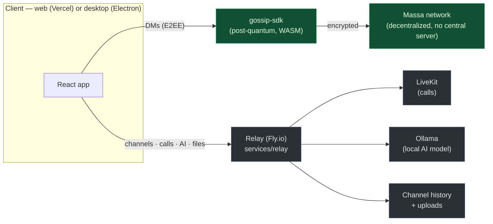

<div align="center">

# Umbry

**A private, decentralized team workspace — Slack/Discord, but the messages are actually private, the AI runs on your own hardware, and there's no vendor server that can be subpoenaed, breached, or shut off.**

[](https://github.com/danielgmorosan/umbry/actions/workflows/desktop.yml)
[](https://github.com/danielgmorosan/umbry/releases/latest)

[**Live app**](https://umbry.chat) · [**Download desktop**](https://github.com/danielgmorosan/umbry/releases/latest) · [Product spec](docs/SPEC.md) · [Architecture & roadmap](docs/INTEGRATION-PLAN.md)

</div>

---

## What is this?

Umbry takes [Gossip's](https://github.com/massalabs/gossip) consumer end-to-end-encrypted messenger — pseudonymous identity (a passphrase, no PII), post-quantum encryption, no central server — and turns it into a **team-collaboration product**: channels, direct messages, voice/video calls, file sharing, and a workspace AI assistant.

The pitch, in one line: **Slack where DMs are provably private, the AI runs on your own machine, and you can self-host the whole thing.**

- 🔒 **DMs are end-to-end encrypted** — reused verbatim from Gossip's 1:1 channel. No server (ours or yours) can read them.
- 💬 **Channels that just work** — public, private, and password-protected, with threads, mentions, edits, reactions, and voice messages.
- 📞 **Calls & huddles** — voice/video/screen-share, per channel or DM, via [LiveKit](https://livekit.io).
- 🤖 **A workspace AI** — recaps and Q&A over the channels you can access, running on a **local open-source model** by default (cloud optional). It can never see your DMs.
- 🖥️ **Native desktop app** — Windows, macOS, and Linux installers, built and published from CI.
- 🏠 **Self-hostable** — run the relay, AI, and calls on your own hardware (in progress — see the roadmap).

> **Identity = a recovery passphrase.** No email, no phone number, no account with us. Your keys are derived from the passphrase and never leave your device.

## Download

Grab the desktop app from the [**latest release**](https://github.com/danielgmorosan/umbry/releases/latest):

| Platform | File |
|---|---|
| Windows | `Umbry.Setup.*.exe` |
| macOS (Apple Silicon) | `Umbry-*-arm64.dmg` |
| macOS (Intel) | `Umbry-*.dmg` |
| Linux | `Umbry-*.AppImage` |

The builds are currently **unsigned**, so on first launch: Windows → SmartScreen → *More info → Run anyway*; macOS → right-click the app → *Open*.

Prefer the browser? The app also runs at **[umbry.chat](https://umbry.chat)**.

## How it works today (the centralized setup)

Two independent transport paths, chosen per privacy level:



- **Direct messages** ride Gossip's decentralized, end-to-end-encrypted 1:1 channel over the Massa network. There is **no server of ours in the path** — not even to relay them.
- **Everything else** (channels, calls, AI, file uploads) goes through a single lightweight **relay** ([`services/relay`](services/relay), a ~1.5k-line Node service on Fly.io). Channel contents are TLS-encrypted in transit and treated as **"workspace-confidential"** — readable by whoever runs the relay, but not end-to-end encrypted *yet* (group E2EE via MLS is on the roadmap). We label this honestly in the UI.
- **The web app** is a static React build on Vercel; **calls** use LiveKit; the **AI** runs on a local open-source model (Ollama) and only ever sees channel content the requester can already access.

### Security model

The relay used to trust whatever `userId` a client claimed. It no longer does:

- **Proven identity.** Every client derives a dedicated Ed25519 key from its recovery passphrase (portable across devices, separate from the post-quantum identity keys). On connect it signs a server challenge; the relay verifies it and **pins the key to the userId** — so nobody can impersonate anyone, read a private channel they're not in, or use a role they don't have.
- **Enforced everywhere.** Privileged actions over the WebSocket, and the AI / call-token / upload HTTP endpoints, all require the proven identity. AI recaps are scoped to the requester's actual channel membership.
- **Locked down.** Per-IP rate limits, a per-socket message cap, and a CORS/WebSocket origin allowlist.

Full write-up in [`docs/INTEGRATION-PLAN.md`](docs/INTEGRATION-PLAN.md).

## The road to fully self-hostable

The endgame is that **you** run the parts that hold your data. Because everything is URL-configured and the relay already fronts calls + AI + channels, this reduces to *which services the client talks to*. Three modes:

| Mode | Who runs it | What it's for |
|---|---|---|
| **A — Managed** *(today)* | Us (Vercel + Fly) | Zero setup — open the app and talk. DMs still E2EE; channels/AI on our infra. |
| **B — Org self-host** *(planned)* | Your team, on one server | `docker compose up` — relay + LiveKit + Ollama + auto-TLS. Invite links point clients at it. Nothing touches us. |
| **C — Fully-local desktop** *(in progress)* | You, on your machine | One toggle in the desktop app spins up a bundled relay, a local LiveKit, and one-click Ollama. Everything runs on your GPU. |

**Progress:**
- ✅ **Hardened desktop shell + cross-platform installers** (this repo's `apps/desktop`, built via CI).
- ✅ **Relay authentication & enforcement** (the security model above) — the prerequisite for safely exposing a self-hosted relay.
- 🔜 **The self-host toggle** — bundle the local services and a Settings switch to flip everything to "run it yourself."

## Features

Messaging (channels + threads + mentions + reactions + edits/deletes), end-to-end-encrypted DMs, voice messages, file & image sharing, code blocks with syntax highlighting, link previews, GIFs, presence (online/invisible), roles & bans, private/password channels, voice/video/screen-share calls with an AI-notetaker hook, a workspace AI assistant (recaps/Q&A), draft rewriting (local-only), notifications, biometric unlock, and a switch-account / start-fresh flow.

## Monorepo layout

```
apps/
  web/                 # the workspace frontend (React 19 + Vite + Tailwind v4)
  desktop/             # Electron shell — loads the web app in a hardened window (+ CI installers)
packages/
  ui/                  # @umbry/ui — shared design system (dark + mint, the brand)
  openclaw-bridge/     # @umbry/openclaw-bridge — typed client for the AI gateway
  miniapp-sdk/         # @umbry/miniapp-sdk — sandboxed host<->miniapp postMessage contract
  config/              # @umbry/config — shared tsconfig base
services/
  relay/               # the message-transfer relay: channels, LiveKit tokens, AI jobs, uploads
  openclaw/            # AI gateway config + gossip channel-plugin notes (sidecar)
vendor/
  gossip/              # git submodule: massalabs/gossip — we consume vendor/gossip/gossip-sdk
```

## Local development

Requires **Node ≥ 20** and **pnpm** (`corepack enable` picks up the pinned version).

```bash
# clone with the gossip submodule (provides gossip-sdk)
git clone --recurse-submodules https://github.com/danielgmorosan/umbry
cd umbry
pnpm install

cp apps/web/.env.example apps/web/.env       # frontend config (no secrets)

# terminal 1 — the relay (channels, calls, AI, uploads) on :8788
cd services/relay && cp .env.example .env && node server.mjs

# terminal 2 — the web app on http://localhost:5173 (Vite proxies to the relay)
pnpm --filter @umbry/web dev
```

Run the desktop shell against your local web server:

```bash
UMBRY_DESKTOP_URL=http://localhost:5173 pnpm --filter @umbry/desktop dev
```

Other tasks: `pnpm typecheck`, `pnpm build`. Full end-to-end DMs additionally need Gossip's WASM crypto built inside the submodule (`vendor/gossip` → `npm run setup && npm run wasm:build`) — see [`docs/SPEC.md`](docs/SPEC.md).

## Cutting a desktop release

Push a `desktop-v*` tag; CI builds Windows/macOS/Linux installers and publishes them to a GitHub Release:

```bash
git tag desktop-v0.1.1 && git push origin desktop-v0.1.1
```

## Stack

React 19 · TypeScript · Vite · Tailwind v4 · Zustand · Electron · LiveKit · Ollama · Node relay (ws) · Fly.io · Vercel · [Gossip SDK](https://github.com/massalabs/gossip) (post-quantum E2EE on Massa).

## Docs

- [`docs/SPEC.md`](docs/SPEC.md) — the full product spec.
- [`docs/INTEGRATION-PLAN.md`](docs/INTEGRATION-PLAN.md) — architecture, the three deployment modes, the security audit + hardening, and the phased roadmap.
